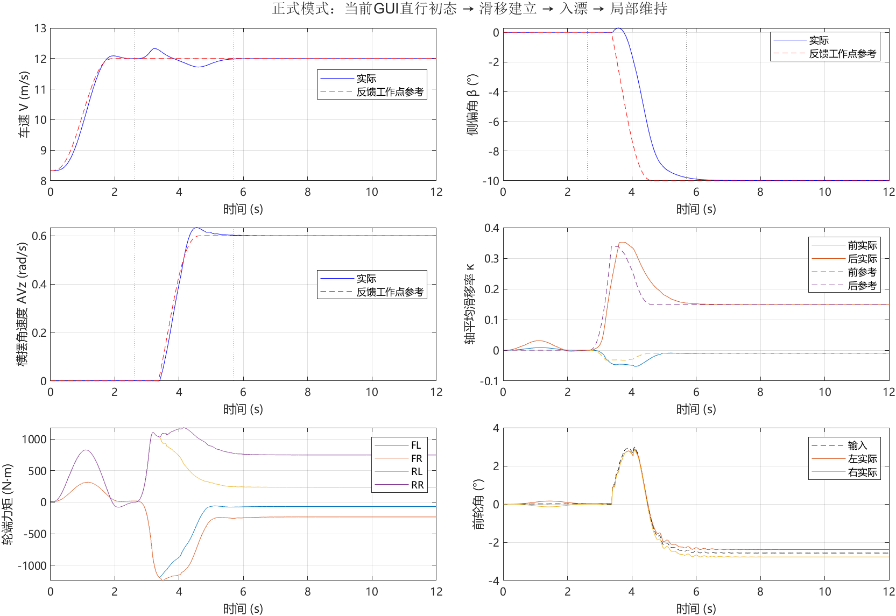
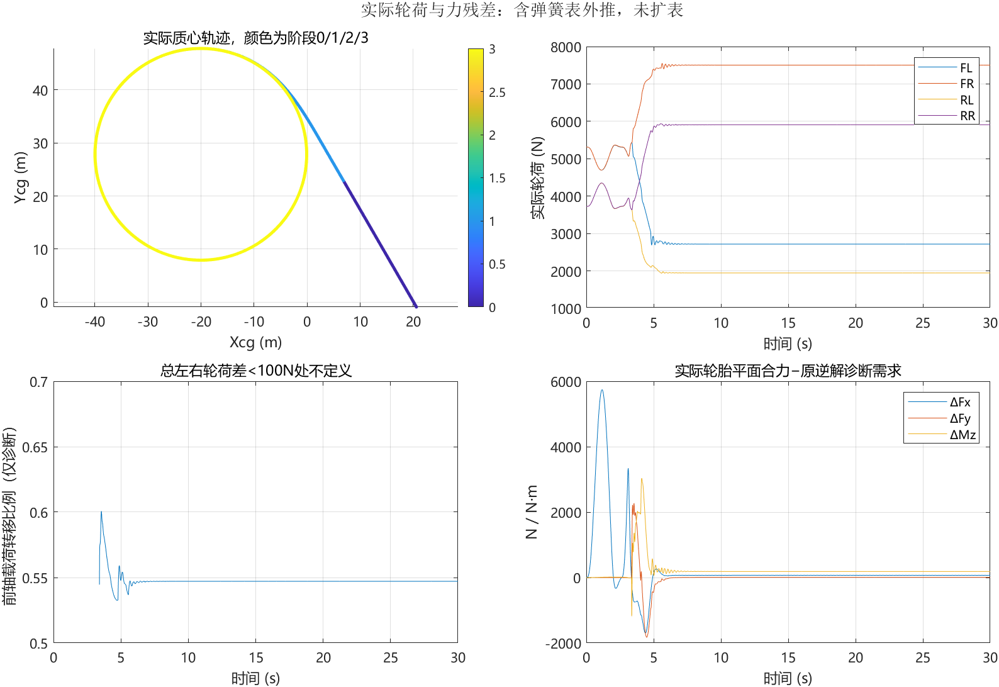
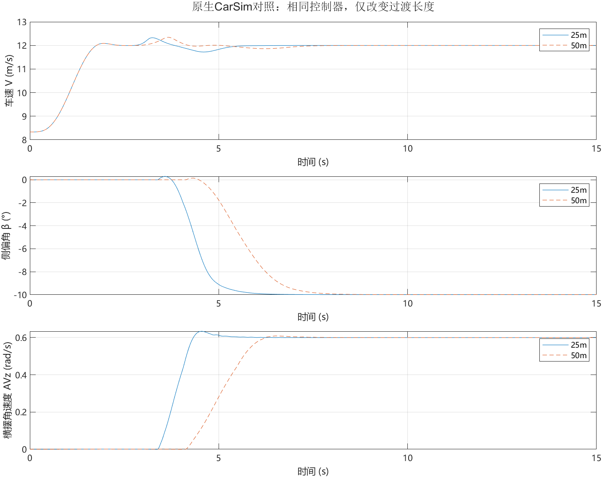

# CarSim–Simulink 漂移动力学仿真平台

旨在通过搭建的漂移动力学仿真平台，试验各种控制方法，以达到控制效果。

## 当前版本：漂移基线 v0.1

**已完成普通初态起漂与局部维持，尚未完成漂移路径跟踪和退出验证。**

版本标签：`drift-entry-hold-v0.1`。本仓库保存2026-09-22已验收的模型、运行依赖、CarSim配置快照和关键原始证据；不是CarSim或MATLAB软件安装包。

当前工况从GUI的30 km/h普通直行初态出发，经过直行加速、后轴滑移建立、横摆及负侧偏建立，切入局部维持。目标为 **12 m/s、β=−10°、AVz=0.6 rad/s**。正式Simulink模型采用25 m过渡并运行30 s，没有恢复漂移初态或持续锁定车辆状态。

| 验收项目 | 正式25 m工况结果 |
|---|---:|
| 开始入漂 | 2.62 s |
| 完成局部接管 | 5.70 s |
| 末5 s速度RMSE | 0.000564 m/s |
| 末5 s侧偏角RMSE | 0.01279° |
| 末5 s横摆角速度RMSE | 0.0000231 rad/s |
| 入漂开始后最低车速 | 11.722 m/s |
| 四轮力矩最大绝对值 | 1243.38 N·m |
| 最终力矩保护激活 | 0 |
| 稳态质心轨迹拟合半径 | 约19.95 m |



## 已实现的控制修改

- 原轴力控制支路使用四轮实际轮荷，删除固定0.7/0.3分配假设；失载、未实现需求和横摆力矩残差保留。
- 采用七个调度工作点，在普通行驶与漂移之间增加后轴滑移建立过程；另有GUI初速对应的直行点。
- 普通行驶反馈使用纵横向结构约束后的局部模型，终点反馈保持冻结。
- 局部起漂支路输出前轮角和轴目标滑移，使用实际四轮Fx做负载补偿；它与原轴力支路不是两套叠加执行命令。
- 按实际状态接管，共用轮速/转向历史；保留完整力矩预算、轮速变化率及分项日志。

## 文件入口

| 位置 | 用途 |
|---|---|
| [model/stabilizer_bar_repair.slx](model/stabilizer_bar_repair.slx) | 唯一核心Simulink模型，算法在对应MATLAB Function块内 |
| [model/a001_new_Design_LQR_Controller.m](model/a001_new_Design_LQR_Controller.m) | 唯一日常初始化入口，只初始化，不自动启动仿真 |
| [model/repair_support](model/repair_support) | 工作点/增益库及两个路径辅助函数 |
| [config](config) | 当前GUI的sim/par原样快照与配置哈希；用于追溯，不自动安装 |
| [中文运行说明](docs/先看这里_实际轮荷与直行入漂.md) | 模式选择、诊断和原机运行方法 |
| [验证报告](docs/验证报告.md) | 改动依据、失败对照、验收与边界 |
| [过渡工作点表](docs/过渡工作点表.md) | 七个调度工作点的状态、前轮角和滑移 |
| [validation](validation/README.md) | 正式30 s原始MAT、CarSim日志/echo及各项核验摘要 |
| [文件哈希清单](MANIFEST.sha256) | 归档文件SHA-256；清单自身不包含在清单内 |

## 运行环境与模式

原环境为Windows、CarSim 2020.0；SLX保存元数据为MATLAB/Simulink R2023a Update 1。需要可用的本机软件许可及原车辆数据环境。

**本版保持已验收代码原样，仍含原机CarSim安装、数据与结果目录的绝对路径。**仓库中的配置快照不能替代完整CarSim环境；下载到另一台电脑后不能保证直接运行。跨机器路径迁移和兼容性未在本版验证，不应把改路径后的新仿真混入本版证据。

在已配置好原CarSim环境、且MATLAB中未加载另一份同名模型时，将当前目录切换到本仓库的 `model`：

```matlab
repair_run_mode = 'drift_entry';
repair_entry_length = 25;
a001_new_Design_LQR_Controller
open_system('stabilizer_bar_repair')
out = sim('stabilizer_bar_repair');  % 真正启动30 s仿真
```

返回原普通路径模式：

```matlab
repair_run_mode = 'normal';
a001_new_Design_LQR_Controller
out = sim('stabilizer_bar_repair');
```

新工作区默认normal；已有工作区保留显式选择。模型初始化回调会重新运行a001。新仿真会更新CarSim现有sim所指定的LastRun输出，**不会自动覆盖仓库validation中的归档证据**。

工作点库与Run_all.par哈希绑定；更换车辆配置需要重新验证。不要删除该检查来把不同车辆的运行结果当作本基线。配置快照和核心模型均保持验收字节，见哈希清单。

## 验证范围和未完成项

- 终点30 s维持、两项输入扰动及七状态正负方向共14次释放试验通过；单方向扰动不证明任意组合扰动都能恢复。
- 25 m、50 m均通过原生CarSim对照；本版正式Simulink全程复测采用25 m。50 m不标记为Simulink全程复测通过。
- 原普通路径模式保留；成功起漂工况关闭路径LQR反馈及式4.10路径项。尚未验证退出、接回路径层及完整操场。
- 后弹簧约1.027 s起超出50 mm表端，记录后继续至30 s，没有扩表；结果包含外推。
- 转向短测最大偏差约0.13°，仍未通过早期0.1°严格门槛；不能把当前闭环可用写成理想转角精确跟随。
- 本版是当前确定性仿真模型的基线，不是原论文完整复现或实车有效性证明。未以多参数、多初态或噪声工况证明鲁棒性。





完整失败试验及研究过程保留本机。原报告中的绝对路径用于追溯，仓库中已上传证据的对应关系见 [验收证据说明](validation/README.md)。
